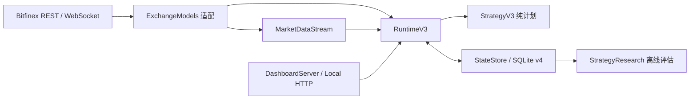

# 架构说明

## 边界

项目只服务单机、单账户、USD Funding。`lendingbot.py` 保留兼容 CLI 和应用组装；交易所数据形状集中在 `ExchangeModels.py`；显式领域类型位于 `DomainTypes.py`；路径和运行依赖由 `AppContext.py` 提供。

核心模块：

- `Configuration.py`：配置解析、V3 策略版本持久化、备份与校验。
- `DashboardServer.py`：本地 HTTP 安全边界、静态资源和路由；业务操作通过显式回调注入。
- `bitfinex.py`：REST 鉴权、公开读取和三态写入结果。
- `MarketDataStream.py`：WebSocket 连接代次、快照门槛及 REST 降级。
- `StrategyV3.py`：纯策略信号、计划与无写入回放。
- `RuntimeV3.py`：账户同步、安全状态机和执行编排。
- `StateStore.py`：schema v5、订单意图、外部挂单接管、成交归属、恢复和研究数据。
- `StrategyResearch.py`：90 天公开数据回填、60/15/15 评估和 Bootstrap 门槛。

## 数据流

跨层新增接口应优先使用 `AccountSnapshot`、`MarketSnapshot`、`StrategyPlan` 和 `WriteResult`，避免继续扩散形状不确定的字典。Bitfinex 原始数组只允许出现在适配器边界。

## 状态与归属

订单写入从 `PLANNED → SUBMITTING → CONFIRMED/CLOSED/AMBIGUOUS`。`write_phase` 记录是否可能已经发往交易所，`resolution` 记录恢复结论，`strategy_variant` 记录基线或候选归属。只有确认绑定 `exchange_offer_id` 的订单才成为机器人托管订单。

运行模式为 `PAUSED / LIVE / REPLAY / APPLYING`。所有停止写入的情况统一显示为 `PAUSED`。普通故障在两次完整 REST 同步后恢复；不确定撤单通过重复 Offers 快照对账；不确定提交通过请求时间附近的 Offers、Funding Trades 和历史 Offers 对账。唯一匹配或稳定确认不存在时恢复此前模式，只有多重候选才要求人工处理。保护原因和是否需要人工处理仍单独持久化，不会因为合并状态而放宽写入条件。
