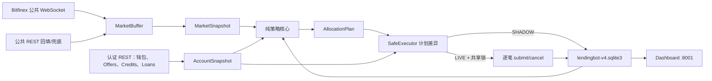

# V4 架构与数据流

## 边界

V4 仅处理 `fUSD`、可见固定利率 `LIMIT`。FRR、Delta、Hidden、USDT、外部 AI 和外部通知不在 V4 边界内。`v4/mika_v4/` 不导入任何根目录 V3 模块；V3 和 V4 可以分别升级、测试和回退。



## 调度层

- WebSocket：持续接收 `fUSD` Funding Book 和 Trades。
- 60 秒：依次读取 funding wallet、Offers、Credits、Loans，形成一次权威账户快照；检测部分成交、订单消失和闲置余额。
- 5 分钟：重新计算异常过滤、锚点、IQR 间距、期限、长期档位、资金分配和小额复投。
- 快速联动：最低档达到 50% 成交或剩余不足 150 USD 时，下一次 60 秒同步确认。市场稳定/下行可提前重建；上涨只记录触发，等待完整周期。

账户余额未知、认证同步失败、市场少于两个新鲜信号或写入结果未知时，策略不写入。

## 领域对象

- `MarketSnapshot`：锚点三信号、滚动中位数、24 小时分位数、动态间距、期限评分和新鲜度。
- `AccountSnapshot`：权威可用余额、总余额、Offers、Credits、Loans。
- `GridGroup` / `GridRung`：网格代次、档位、原始/剩余金额、利率、期限、Offer ID 和底线计时。
- `AllocationPlan`：本批可部署金额、闲置金额、长期档位、目标订单和下一规划状态。
- `ExecutionIntent`：带唯一指纹的 SUBMIT/CANCEL 意图及状态。
- `StrategyStatus`：供 Dashboard 使用的策略、账户、市场和 SAFE 摘要。

策略计算集中在纯函数中；只有 `SafeExecutor` 消费计划差异并执行交易所写入。

## 资金口径

一次重建的可部署批次为：

```text
权威钱包可用余额 + 本次涉及资金池中 V4 托管、尚未成交的 Offer 剩余金额
```

已成交 Credits/Loans 不进入本批分配。Funding wallet 的 `balance` 用作本金和金额上限的权威口径，`available + offers + credits/loans` 只用于对账。

5–149.99999999 USD 的新增余额在完整周期优先合并到已有短期组；没有短期组时合并到中期组；两者都不存在则留在钱包累计到 150 USD。

## 持久化与幂等

独立数据库默认位于 `v4/.state/lendingbot-v4.sqlite3`，保存：

- 网格组、代次和档位状态；
- 原始/剩余金额、部分成交和底线到达时间；
- 期限与长期门控的连续确认状态；
- 重建原因与每小时次数；
- 待撤单计划和执行意图；
- SHADOW 计划、真实行情、账户采样和导入记录。

进程重启后，未完成的 `PLANNED/SUBMITTING/AMBIGUOUS` 意图会阻止继续写入。相同结构计划使用稳定指纹去重，不会因为重启重复提交。

## 两阶段重建

1. 计算每个资金池当前形状与目标形状，只标记变化的组。
2. 对变化组逐个按 Offer ID 撤单并保存 `WAIT_CANCELS`。
3. 下一次权威账户快照仍看到这些 ID 时继续等待。
4. 快照确认 ID 消失后，重新检查钱包可用余额。
5. 余额足够才提交该组新档位；余额变化则要求重新规划。

长期组在档位不变时不会因为锚点微小变化频繁撤挂；同档位锚点重定价最多每小时一次，长期档位升降或达到 720 分钟底线滞留条件时也可重建。
